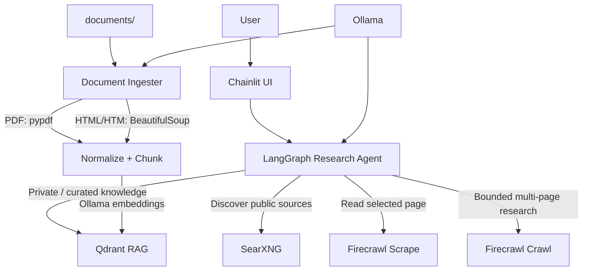

# Cruise Research Agent — Demo

A compact portfolio/reference implementation of an agentic research assistant built with **Chainlit**, **LangGraph**, **Qdrant**, **SearXNG**, **Firecrawl**, and **Ollama**.

> **Portfolio / demonstration scope**
>
> This repository is intentionally simplified for public demonstration. The local RAG knowledge base used by this demo contains proprietary reference material for **Princess Cruises** and **Royal Caribbean only**.
>
> My proprietary production research platform contains substantially broader travel-vendor data and uses a more sophisticated LangGraph architecture, including additional planning, routing, evidence-management, validation, and research-quality controls that are intentionally not reproduced in this public repository.
>
> Proprietary source documents and production prompts/configuration are **not included** in this repository.

## Live demo

A running instance of this portfolio agent is available at:

**https://cruise-research-demo.davidrintoul.info/**

It is the same public reference implementation described in this repository and does not expose proprietary production data, prompts, or business logic.

## What this project demonstrates

This project shows a small but complete research workflow that can combine:

- **Private knowledge retrieval (RAG)** from Qdrant
- **Public web discovery** through SearXNG
- **Single-page content acquisition** through Firecrawl scrape
- **Bounded multi-page acquisition** through Firecrawl crawl
- **Local LLM inference and embeddings** through Ollama
- **Tool orchestration** through LangGraph
- **Interactive UI** through Chainlit
- **Automatic local document ingestion** for PDF, HTML, and HTM files
- **Content-hash deduplication and document version replacement**

The design is deliberately understandable at a glance. It is a portfolio reference implementation rather than a copy of the production system.

## Demo vs. production system

| Area | Public portfolio demo | Proprietary production system |
|---|---|---|
| RAG vendor scope | Princess Cruises, Royal Caribbean | Broader travel-vendor knowledge base |
| Graph design | Basic LangGraph tool-calling loop | More sophisticated multi-stage research graph |
| Search | SearXNG | Production research/search strategy |
| Web acquisition | Firecrawl scrape/crawl | Broader controlled acquisition strategy |
| Evidence handling | Tool results returned to agent | More extensive evidence/provenance controls |
| QA / validation | Prompt-level research rules | Additional validation and research-quality stages |
| Source documents | Not included publicly | Proprietary internal corpus |

The purpose of this repository is to make the core architecture inspectable without publishing proprietary data, prompts, business logic, or the full production research strategy.

## Architecture



The research agent exposes four tools:

```text
search_knowledge_base -> Qdrant
search_web            -> SearXNG
scrape_url            -> Firecrawl
crawl_site            -> Firecrawl
```

The intended division of responsibility is:

```text
Qdrant    = curated/private knowledge retrieval
SearXNG   = public source discovery
Firecrawl = public source content acquisition
Ollama    = LLM inference + embeddings
LangGraph = bounded agent/tool orchestration
Chainlit  = interactive user interface
```

## Knowledge-base scope

The demonstration RAG corpus is intentionally limited to:

- **Princess Cruises**
- **Royal Caribbean**

A typical local document layout is:

```text
documents/
├── Princess Cruises/
│   ├── packages.pdf
│   ├── dining.html
│   └── policies.htm
│
└── Royal Caribbean/
    ├── beverage-packages.pdf
    ├── dining.html
    └── policies.pdf
```

The first directory under `documents/` becomes the `provider` metadata value used by Qdrant retrieval. The ingester enforces an explicit provider allowlist:

```python
ALLOWED_PROVIDERS = {
    "Princess Cruises",
    "Royal Caribbean",
}
```

Supported files placed directly in `documents/` or under any other top-level directory are ignored and logged as disallowed-provider documents. This prevents an accidental folder such as `documents/Universal/` from becoming part of the public demo RAG corpus.

Questions about other cruise lines, hotels, theme parks, destinations, or vendors are **not answered from this demo knowledge base**. The agent can still research public information about them using SearXNG and Firecrawl.

## Automatic document ingestion

The `document-ingester` service recursively watches `documents/` for:

```text
.pdf
.html
.htm
```

### PDF files

PDF text is extracted with `pypdf`. Chunk metadata preserves information such as:

- provider
- document title
- source path
- document hash
- page number
- page count
- chunk ID
- ingestion timestamp

Image-only/scanned PDFs are not OCR'd by this reference implementation.

### HTML / HTM files

Local HTML files are processed with BeautifulSoup. The ingester:

- removes scripts, styles, navigation, headers, footers, forms, and other page chrome
- prefers `<main>`, then `<article>`, then an element with `role="main"`, then `<body>`
- preserves useful headings and section structure
- captures canonical source URLs when present
- records section titles and heading paths in Qdrant metadata

Firecrawl is **not** used to process local HTML files. Firecrawl is reserved for live public web pages.

## Deduplication and document updates

Every source file is hashed with SHA-256 before ingestion.

```text
file
  |
  v
SHA-256
  |
  +-- same hash already in Qdrant --> skip
  |
  +-- new hash
        |
        +-- new source_path --> ingest
        |
        +-- existing source_path with different hash
                 |
                 v
          ingest new version
                 |
                 v
          remove old chunks
```

This provides two useful behaviors:

1. Copying or rescanning an unchanged document does not create duplicate chunks.
2. Replacing a file at the same relative path with updated content causes the older version to be replaced.

The ingester periodically rescans the directory. The polling interval is configured with:

```env
INGEST_SCAN_INTERVAL_SECONDS=300
```

## RAG metadata

A PDF chunk is stored with metadata similar to:

```json
{
  "source_type": "pdf",
  "provider": "Princess Cruises",
  "title": "Example Document",
  "source_path": "Princess Cruises/example.pdf",
  "document_id": "...",
  "document_hash": "...",
  "chunk_id": "...",
  "page_number": 12,
  "page_count": 32,
  "ingested_at": "...",
  "text": "..."
}
```

An HTML chunk can additionally contain:

```json
{
  "source_type": "html",
  "mime_type": "text/html",
  "source_url": "https://example.com/source-page",
  "section_title": "Dining",
  "heading_path": ["Packages", "Dining"]
}
```

This metadata allows the agent to provide meaningful document provenance instead of treating retrieved vectors as anonymous context.

## Live web research

### SearXNG

SearXNG is used only for **source discovery**.

Search snippets are treated as candidate-source metadata rather than primary evidence. The normal workflow is:

```text
SearXNG search
     |
     v
candidate URL
     |
     v
Firecrawl scrape
     |
     v
main page content
```

For current or verifiable questions about Princess Cruises or Royal Caribbean, the deterministic research branch restricts `search_web` to the cruise line's own domain (`site:princess.com` or `site:royalcaribbean.com`). This avoids third-party blogs and booking sites and improves source quality.

### Firecrawl scrape

For a selected public URL, the agent uses Firecrawl `/v2/scrape` with:

```json
{
  "formats": ["markdown"],
  "onlyMainContent": true
}
```

This removes most navigation and page chrome before the content is returned to the research agent.

### Firecrawl crawl

Crawl is reserved for cases where relevant information genuinely spans multiple related pages. It is bounded by configured maximum page and depth limits and also requests main content only.

## LangGraph

The public implementation intentionally uses a straightforward tool-calling graph:

```text
START
  |
  v
agent
  |
  +---- tool call? ---- yes ----> tools
  |                              |
  no                             |
  |                              v
  v                            agent
 END
```

A hard maximum LLM/tool-cycle budget prevents unrestricted loops.

This graph is intentionally **less sophisticated than the LangGraph architecture used in my proprietary production research platform**. The production system separates additional responsibilities such as research planning, deterministic routing, targeted acquisition, evidence management, completeness analysis, source validation, and quality assurance.

That production complexity is not necessary to demonstrate the core concepts in a public portfolio repository and would expose implementation details that are intentionally private.

## Chainlit UI

The Chainlit UI explicitly identifies the application as a portfolio demonstration and explains the RAG scope when each chat starts.

The local knowledge base is limited to Princess Cruises and Royal Caribbean. For other vendors, the agent should use public web research and must not imply that those vendors are represented in local RAG.

## Services

This Compose project owns three containers:

```text
research-agent
  Chainlit + LangGraph

document-ingester
  periodic PDF/HTML/HTM -> Qdrant ingestion

qdrant
  dedicated vector database for this demo
```

The following are expected to exist separately:

```text
Ollama
SearXNG
Firecrawl
```

This keeps infrastructure services independent from the portfolio application.

## Prerequisites

- Docker Engine + Docker Compose
- Running Ollama service
- Running SearXNG service with JSON output enabled
- Running Firecrawl service
- Ollama chat model that supports tool calling
- Ollama embedding model

Example models used by the supplied `.env.example`:

```text
qwen3:8b
nomic-embed-text
```

Pull them on the Ollama host if necessary:

```bash
ollama pull qwen3:8b
ollama pull nomic-embed-text
```

## Configuration

Copy the example environment file:

```bash
cp .env.example .env
```

Review every value in `.env` before starting the application.

The Compose file intentionally does not contain configuration fallback values. `.env` is the source of runtime configuration for the application.

Typical external service URLs when the services publish ports on the Docker host are:

```env
OLLAMA_BASE_URL=http://host.docker.internal:11434
SEARXNG_BASE_URL=http://host.docker.internal:8088
FIRECRAWL_BASE_URL=http://host.docker.internal:3002
```

Qdrant is internal to this Compose project:

```env
QDRANT_URL=http://qdrant:6333
```

## Starting the application

Build and start all project services:

```bash
docker compose up -d --build
```

Check status:

```bash
docker compose ps
```

The expected services are:

```text
basic-agentic-research-agent
basic-agentic-research-ingester
research-qdrant
```

All three have Docker health checks. The application and ingester wait for Qdrant readiness before starting.

## Monitoring ingestion

Follow the ingester logs:

```bash
docker compose logs -f document-ingester
```

Typical behavior:

```text
Scanning /app/documents: found 12 supported document(s) (.pdf, .html, .htm)
SKIP unchanged/duplicate document: Princess Cruises/packages.pdf [...]
INGESTED Royal Caribbean/policies.html: 14 chunks [...]
Scan complete: discovered=12 ingested=1 skipped=11 failed=0 chunks=14
```

Run a one-time scan manually:

```bash
docker compose run --rm document-ingester python ingest.py --once
```

## Opening Chainlit

By default, with:

```env
CHAINLIT_PORT=8000
```

open:

```text
http://localhost:8000
```

## Example questions

Try these starter questions to exercise different capabilities:

**Knowledge base**

> What information is available about suite benefits on Princess Cruises?

**Cross-vendor RAG**

> Compare the suite-related benefits described in the Princess Cruises and Royal Caribbean knowledge base.

**Current web research**

> What are the current Princess Cruises package options and prices?

**RAG plus current web validation**

> Using the knowledge base as background, verify the current Royal Caribbean suite benefits against official public sources.

**Knowledge base**

> What information is available about suite benefits on Royal Caribbean?

**Current web research**

> What are the current Royal Caribbean package options and prices?

The agent should make clear that Disney is not represented in this demonstration knowledge base.

## Directory structure

```text
basic-agentic-research-agent/
├── .chainlit/
│   └── config.toml
├── documents/
│   └── .gitkeep
├── .dockerignore
├── .env.example
├── .gitignore
├── app.py
├── docker-compose.yaml
├── Dockerfile
├── ingest.py
├── README.md
├── requirements.txt
└── tools.py
```

## Protecting proprietary source material

The repository is designed so proprietary knowledge-base files remain local.

`.gitignore` excludes:

```text
*.pdf
*.html
*.htm
```

under `documents/`, while `documents/.gitkeep` preserves the directory itself.

`.dockerignore` excludes the entire `documents/` directory from image build context. Documents are instead mounted read-only into the ingester at runtime:

```yaml
volumes:
  - ./documents:/app/documents:ro
```

Do not commit proprietary supplier documents, Qdrant storage, API credentials, private prompts, or production configuration to the public repository.

## Intentional limitations

This repository is deliberately not a production-complete research platform. In particular:

- The RAG corpus is limited to Princess Cruises and Royal Caribbean.
- Web research for current or verifiable details is restricted to the cruise line's own domain (`princess.com`, `royalcaribbean.com`) to avoid third-party sources.
- The source documents are not distributed with the repository.
- The graph is a basic bounded tool-calling graph.
- There is no OCR fallback for scanned PDFs.
- There is no production authentication/authorization layer.
- There is no public reproduction of the production research planner, completeness checks, QA graph, or proprietary prompts.
- Search, scraping, crawling, and LLM services are assumed to be separately operated infrastructure.

These constraints are intentional. The project exists to demonstrate the architecture and engineering approach without publishing proprietary data or the full production implementation.
